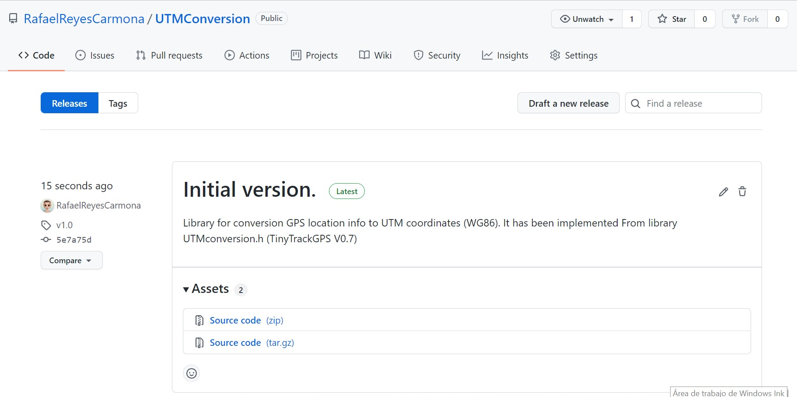
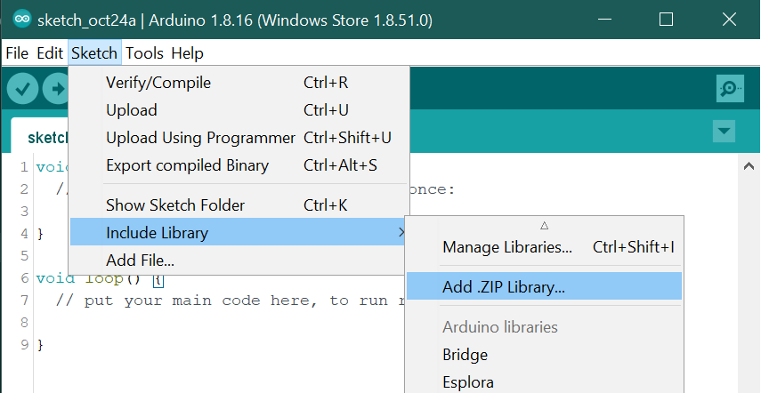
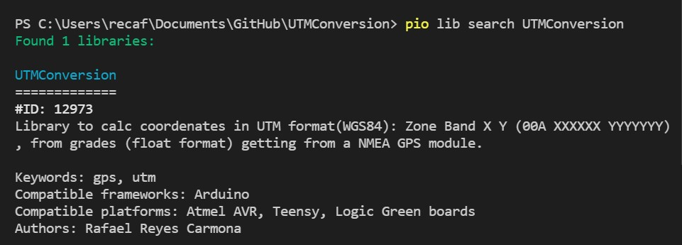
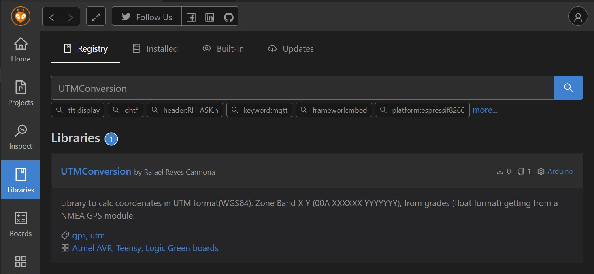
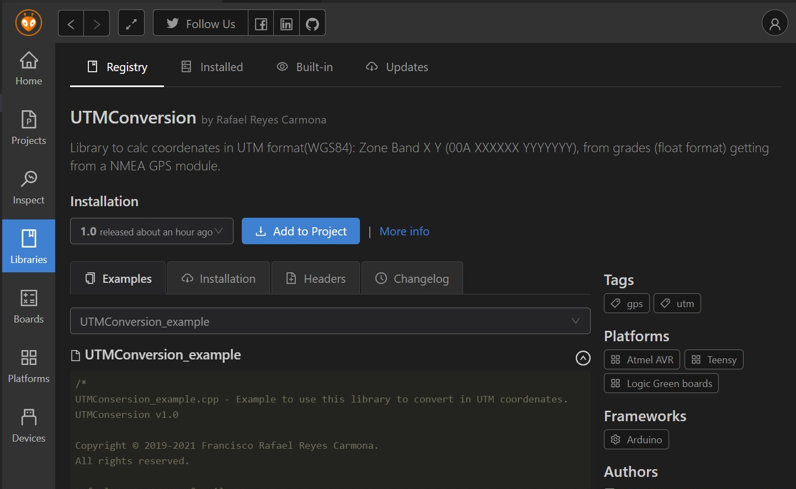
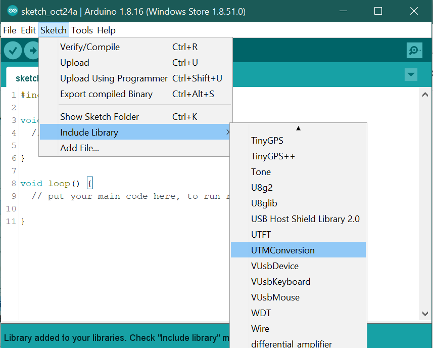
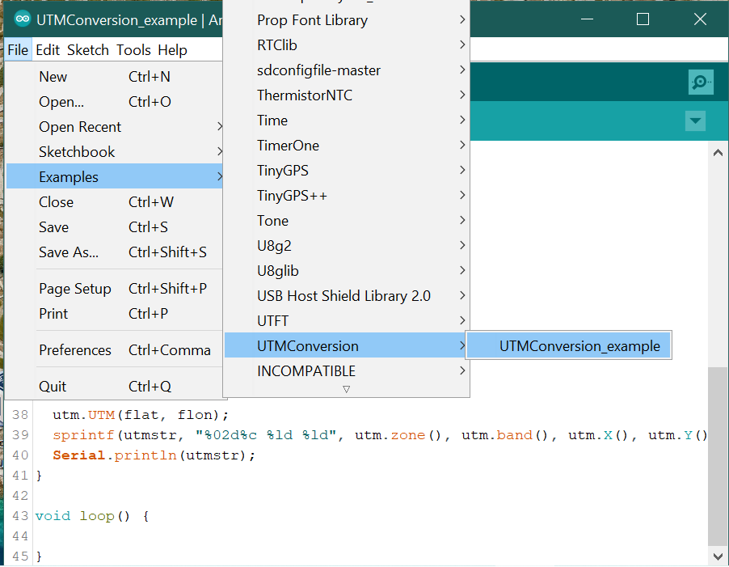

# UTMConversion #

[](README.md)
[]()

Library for conversion GPS location info to UTM coordinates (WG86). It has been implemented From library UTMconversion.h (TinyTrackGPS V0.7)

## Installation ##

### Arduino IDE ###

For a tutorial on how to install new libraries for use with the Arduino
development environment please refer to the following website:
http://www.arduino.cc/en/Reference/Libraries

--- or ---

1. Download the ZIP file from the page [releases](https://github.com/RafaelReyesCarmona/UTMConversion/releases) to your machine.
<p align=center>

</p>

2. In the Arduino IDE, choose Sketch/Include Library/Add Zip Library.
<p align=center>

</p>

3. Navigate to the ZIP file, and click Open.

### PlatformIO ###

How to use the library in PlatformIO see [documentation](https://docs.platformio.org/en/latest/librarymanager/index.html) of Library Manager.

The only one simple step is to define dependencies in “platformio.ini” (Project Configuration File). For example,

```
[env:pro16MHzatmega328]
platform = atmelavr
board = pro16MHzatmega328
framework = arduino
lib_deps = rafaelreyescarmona/UTMConversion

[env:LGT8F328]
board = LGT8F328P
board_build.f_cpu = 32000000
platform = lgt8f
framework = arduino
lib_deps = rafaelreyescarmona/UTMConversion@^1.0.0
```

For Manual installation in PlatformIO Core:

1. Run a terminal and type for search the library: 
```
pio lib search UTMConversion
```
<p align=center>

</p>

2. Type for install:
```
pio lib install 12973
```

--- or ---

1. Search "UTMConversion" in search box of _Libraries_ of panel.
<p align=center>

</p>

2. Click _Add to project_ button. Library will be included in the project and "platformio.ini" updated.
<p align=center>

</p>

## How to use the library ##

In Arduino IDE, Choose Sketch/Include Library/Scroll and select "UTMConversion".
<p align=center>

</p>

There are a two examples files with the library. In the Arduino IDE, choose File/Examples/UTMConversion, and you can see "UTMConversion_example".

<p align=center>

</p>

--- or ---

Example of use:

```C++
#include "UTMconversion.h"

float flat = 37.8959210;
float flon = -4.7478210;

GPS_UTM utm;

void setup() {
  char utmstr[] = "30S 123456 1234567";

  Serial.begin(9600);  

  utm.UTM(flat, flon);
  sprintf(utmstr, "%02d%c %ld %ld", utm.zone(), utm.band(), utm.X(), utm.Y());
  Serial.println(utmstr);
}

void loop() {

}
```